# Realtime Stock Control System 📦⚡

Gerçek zamanlı stok olaylarını Kafka üzerinden işleyip MongoDB Atlas, FastAPI ve Streamlit katmanlarıyla izleyen; Airflow ve Spark entegrasyonlarıyla zenginleştirilmiş uçtan uca gerçek zaman + yakın gerçek zaman veri platformu.

**Temel Akış:** Producer → Kafka Cluster → Consumer → MongoDB → API (FastAPI) → Dashboard (Streamlit) → (Airflow DAG tetiklemeleri & Spark Structured Streaming) → HDFS / Raporlama.

---

## 🗺️ İçindekiler
1. [Bileşenler ve Mimari](#-bileşenler-ve-mimari)
2. [Servis & Port Haritası](#-servis--port-haritası)
3. [Kafka Topic Stratejisi](#-kafka-topic-stratejisi)
4. [MongoDB Şema & Indexler](#-mongodb-şema--indexler)
5. [Hızlı Başlangıç](#-hızlı-başlangıç)
6. [Klasör Yapısı](#-klasör-yapısı-özet)
7. [Airflow DAG'leri](#-airflow-dagleri)
8. [Spark & HDFS Entegrasyonu](#-spark--hdfs-entegrasyonu)
9. [API & Dashboard](#-api--dashboard)
10. [Sorun Giderme](#-sorun-giderme)
11. [Lisans / Kullanım](#-lisans--kullanım)

---

## 🏗️ Bileşenler ve Mimari

1) **Producer**  
Ürün stok değişimlerini simüle eder ve Kafka'ya `stock_updates` topic'ine yazar.

2) **Kafka Cluster**  
3 broker (external: 9092, 9093, 9094; internal: 29092, 29093, 29094) + Zookeeper (2181). İzleme için Kafka UI kullanılır.

3) **Consumer**  
`stock_updates` mesajlarını okur ve MongoDB'ye idempotent şekilde yazar (`_id = {topic}-{partition}-{offset}`). Koleksiyonlar: `inventory.stock_events`, `inventory.stock_logs`, `inventory.products`, `inventory.product_info`.

4) **MongoDB Atlas**  
Global erişilebilir, güvenli bağlantı (IP allowlist + kullanıcı/parola). Opsiyonel yerel container ileride eklenebilir.

5) **Airflow**  
Orkestrasyon: gerçek zaman veriye dayalı özet/rapor ve Spark job tetikleme DAG'leri. Web arayüzü: http://localhost:8082

6) **FastAPI**  
REST + OpenAPI dokümantasyonu. Dashboard bu katmandan veri tüketir.

7) **Streamlit Dashboard**  
Gerçek zaman envanter ve metrik görselleştirme. Web: http://localhost:8501

8) **Spark Structured Streaming**  
`stock_streaming.py` ile Kafka'dan mikro-batch / continuous processing; özetler için HDFS / Mongo sink hazırlıkları.

9) **HDFS / HDFS Yazma**  
`write_hdfs_summary_dag.py` üzerinden stok olaylarından günlük özetlerin HDFS'e aktarımı.

10) **Gözlemleme Araçları**  
Kafka UI (topic & consumer lag), Portainer (container yönetimi). Gelecekte Prometheus + Grafana.

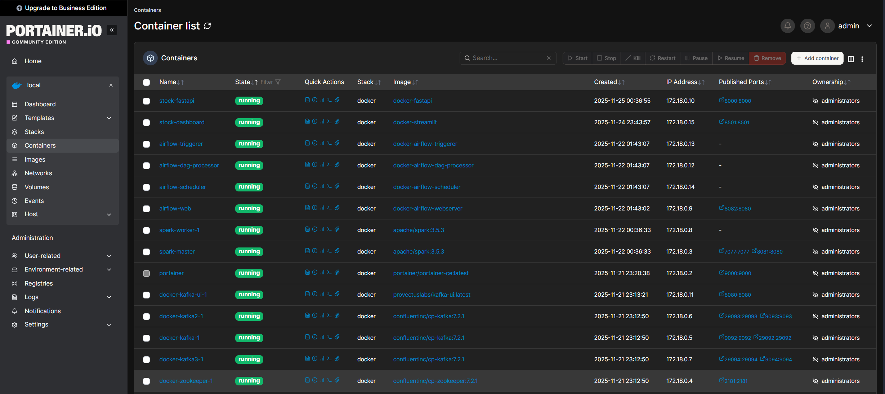

11) **LLM / Agents (Opsiyonel)**  
`agents/stock_agent.py` ile GROQ LLM entegrasyonu kullanarak doğal dil sorgulamaları yapabilirsiniz.

---

## 🌐 Servis & Port Haritası

| Servis | Port | Açıklama |
|--------|------|----------|
| Zookeeper | 2181 | Kafka koordinasyonu |
| Kafka Broker 1 | 9092 / 29092 | External / Internal |
| Kafka Broker 2 | 9093 / 29093 | External / Internal |
| Kafka Broker 3 | 9094 / 29094 | External / Internal |
| Kafka UI | 8080 | Topic & consumer izleme |
| Airflow Web | 8082 | DAG yönetimi |
| FastAPI | 8000 | REST API |
| Streamlit | 8501 | Dashboard |
| Portainer | 9000 | Container yönetimi |
| Spark Master UI | 8081 | Spark izleme |

---

## 🧩 Kafka Topic Stratejisi
- **Topic:** `stock_updates`
- **Partition:** 3 (yük dengeleme & paralel tüketim)
- **Replication Factor:** 3 (yüksek erişilebilirlik)

### Kafka UI - Topic Görünümü
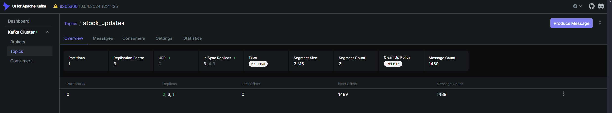

### Topic Ayarları & Analiz
| Topic Ayarları | Topic Analizi |
|----------------|---------------|
| 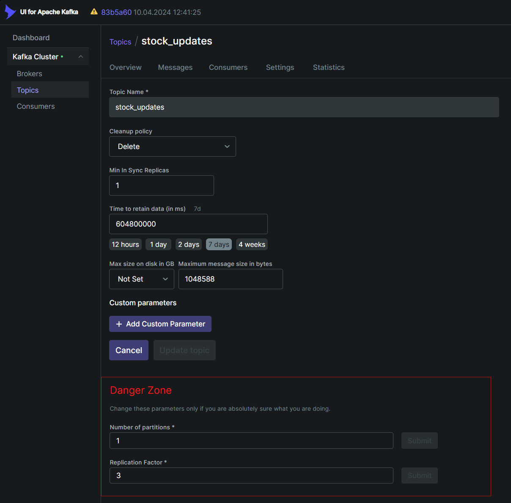 | 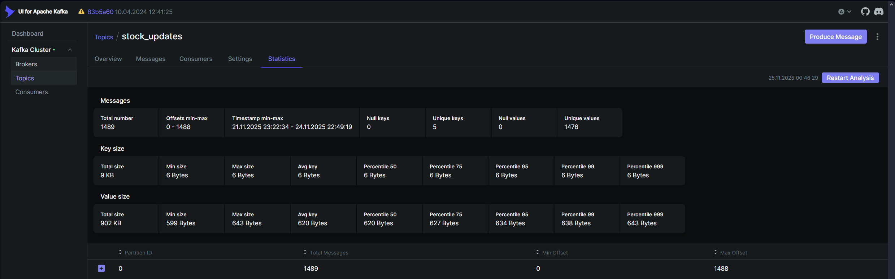 |

### Kafka Volume Yapılandırması
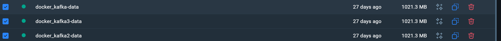

---

## 🗄️ MongoDB Şema & Indexler
Database: `inventory`

| Koleksiyon | Amaç | Önemli Alanlar | Index |
|------------|------|----------------|-------|
| `stock_events` | Ham olay | `_id`, `product_id`, `delta`, `ts` | `_id` PK, `product_id` (opsiyonel) |
| `stock_logs` | Ayrıntılı log | `event_id`, `ts`, `source` | `ts` desc |
| `products` | Anlık stok durumu | `product_id`, `quantity`, `updated_at` | `product_id` unique |
| `product_info` | Ürün meta | `product_id`, `name`, `category` | `product_id` unique |

### MongoDB Explorer Görünümü
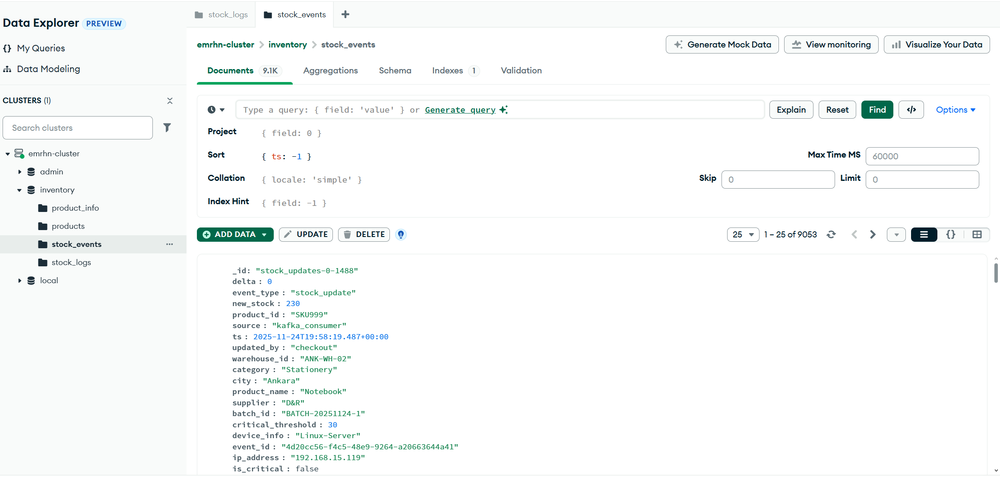

---

## ⚙️ Hızlı Başlangıç

### Önkoşullar
- Docker Desktop (çalışır durumda)
- Python 3.10+ (producer & consumer'ı lokalde çalıştıracaksanız)
- Git

### 1. Projeyi Klonla
```bash
git clone https://github.com/emrhnaksu/realtime-stock-control.git
cd realtime-stock-control/real-time-stock-tracker
```

### 2. `.env` Dosyasını Yapılandır
`.env` dosyasını düzenleyin ve kendi bilgilerinizi girin:
```env
# MongoDB Atlas Bağlantı Bilgileri
MONGO_DB_USERNAME=your_username
MONGO_DB_PASSWORD=your_password
MONGO_DB_HOST=your-cluster.mongodb.net

# GROQ API (AI Agent için - opsiyonel)
GROQ_API_KEY=your_groq_api_key
GROQ_MODEL=llama-3.1-8b-instant
ENABLE_GROQ=false

# FastAPI URL
API_URL=http://localhost:8000
```

### 3. Docker Altyapısını Başlat
```powershell
cd docker
docker compose up -d
```

### 4. Topic Kontrolü
- http://localhost:8080 → Clusters → Topics → `stock_updates`

### 5. Servisleri Doğrula
| Servis | URL | Kullanıcı/Şifre |
|--------|-----|-----------------|
| Kafka UI | http://localhost:8080 | - |
| FastAPI Swagger | http://localhost:8000/docs | - |
| Streamlit Dashboard | http://localhost:8501 | - |
| Airflow | http://localhost:8082 | admin/admin |
| Portainer | http://localhost:9000 | İlk girişte ayarla |
| Spark Master UI | http://localhost:8081 | - |

> **Not:** MongoDB Atlas kullanılmaktadır. IP allowlist & kullanıcı yetkilerini kontrol edin.

---

## 📁 Klasör Yapısı (Özet)
```text
real-time-stock-tracker/
├── docker/
│   └── docker-compose.yml
├── airflow/
│   ├── Dockerfile
│   ├── requirements.txt
│   ├── dags/
│   │   ├── hello_dag.py
│   │   ├── kafka_producer_dag.py
│   │   ├── kafka_consumer_dag.py
│   │   ├── spark_streaming_submit_dag.py
│   │   ├── stream_summary_dag.py
│   │   └── report_generation.py
│   └── scripts/
│       ├── kafka_producer.py
│       ├── kafka_consumer.py
│       └── stream_summary.py
├── fastapi-app/
│   ├── app_fastapi.py
│   ├── Dockerfile
│   └── requirements.txt
├── streamlit-app/
│   ├── app.py
│   ├── Dockerfile
│   └── requirements.txt
├── spark_jobs/
│   ├── stock_streaming.py
│   └── Dockerfile
├── agents/
│   └── stock_agent.py
├── tools/
│   └── mongo_tool.py
├── docs/
│   └── images/
├── .env
└── requirements.txt
```

---

## 🧪 Airflow DAG'leri
| DAG | Amaç | Frekans | Not |
|-----|------|---------|-----|
| `hello_dag.py` | Örnek / sağlık kontrolü | Dakikalık | Basit print task |
| `kafka_producer_dag.py` | Producer tetikleme (opsiyonel) | Dakikalık / manuel | Lokal script entegrasyonu |
| `kafka_consumer_dag.py` | Consumer kontrol / tetikleme | Dakikalık / manuel | Lag gözlemine uyarlanabilir |
| `spark_streaming_submit_dag.py` | Spark job submit | Manuel / periyodik | Structured Streaming başlatma |
| `stream_summary_dag.py` | Akış özet metrik üretimi | Dakikalık | Kafka → Özet dokümantasyon |
| `write_hdfs_summary_dag.py` | HDFS'e özet yazımı | Günlük | HDFS sink |
| `report_generation.py` | Rapor PDF/CSV üretimi | Günlük | Metrik derleme |

### Kafka Producer & Consumer Logları
| Producer | Consumer |
|----------|----------|
| 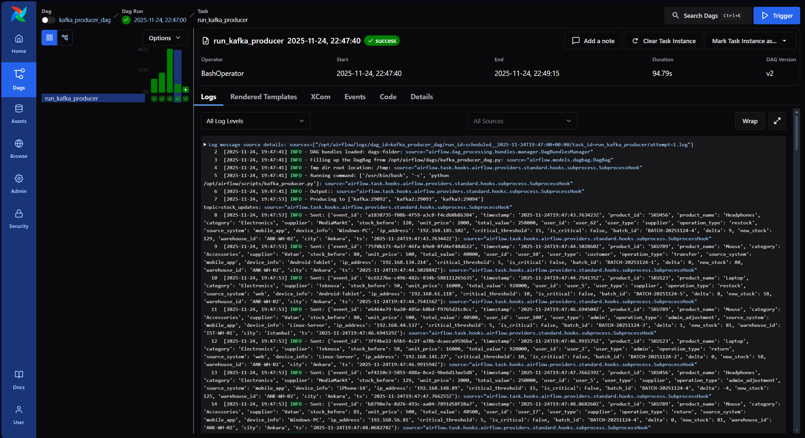 | 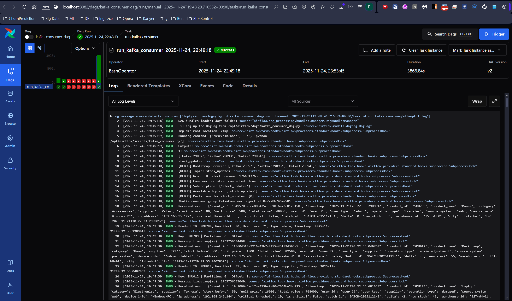 |

---

## 🔥 Spark & HDFS Entegrasyonu
- `spark_streaming_submit_dag.py` DAG'i, `spark_jobs/stock_streaming.py` script'ini tetikler.
- HDFS yazımı için: `write_hdfs_summary_dag.py` (Kafka'dan gelen olayların günlük agregasyonu).

### HDFS Yazma İşlemi
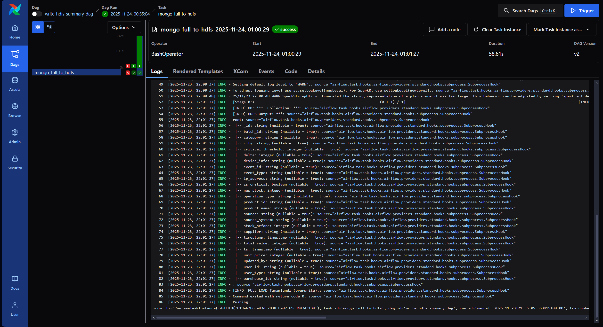

**Gelecek adımlar:** Spark cluster (master/worker) container'ları, checkpoint directory stratejisi, schema evolution.

---

## 🔌 API & Dashboard
- **FastAPI:** `fastapi-app/app_fastapi.py` (OpenAPI docs: http://localhost:8000/docs)
- **Streamlit:** `streamlit-app/app.py` → `API_URL` env değişkeni ile FastAPI bağlantısı

### FastAPI Swagger Docs
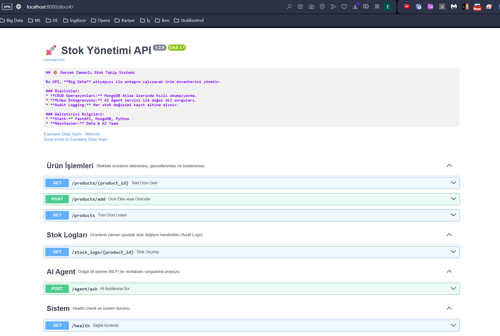

### Streamlit Dashboard Ekranları

#### Ürünler Listesi
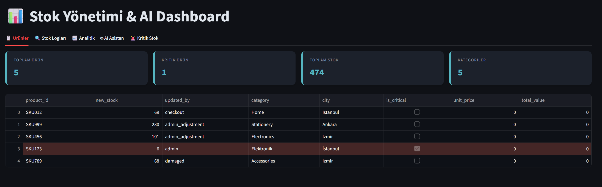

#### Stok Logları
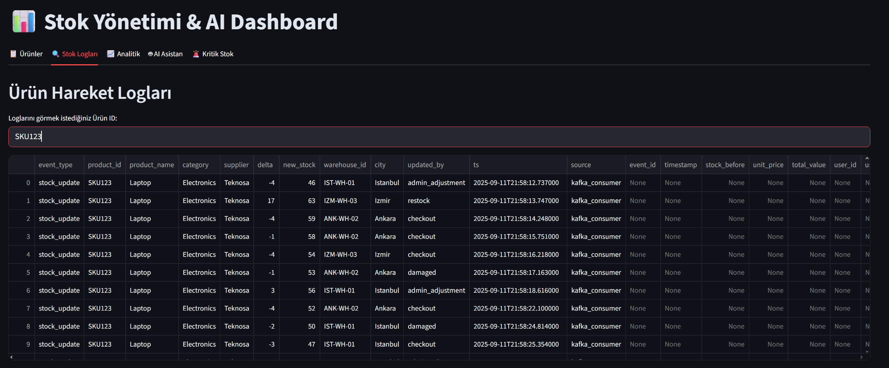

#### Analitik Görünüm
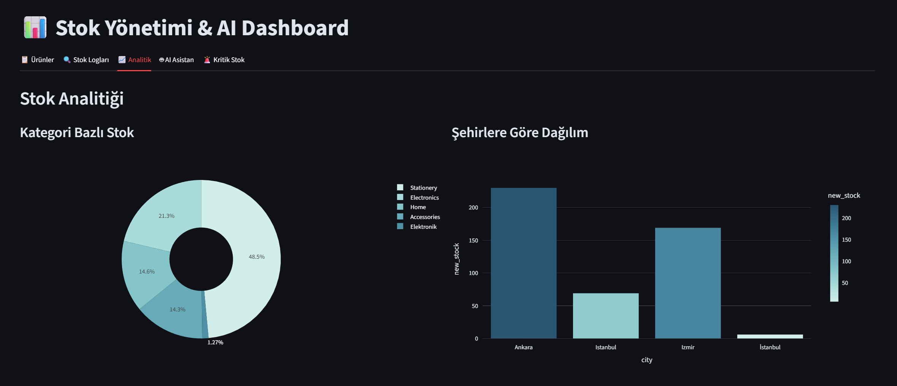

#### Kritik Stok Uyarıları
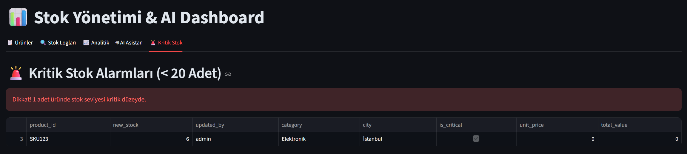

#### AI Agent Sorgulamaları
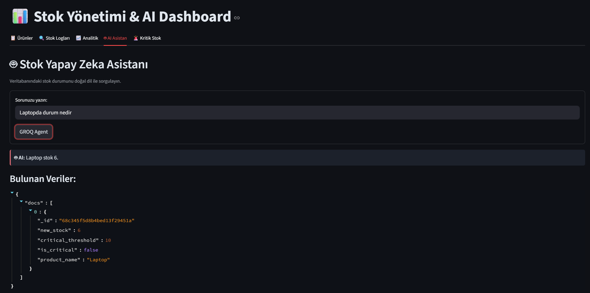

---

## 🧩 Sorun Giderme

| Problem | Çözüm |
|---------|-------|
| Kafka UI bağlanmıyor | 3 broker container'larının ayakta olduğundan emin olun; network alias'ları kontrol edin |
| MongoDB bağlantı hatası | Atlas kullanıcı bilgileri + IP allowlist + `.env` doğrulayın |
| PowerShell sanal ortam | `Set-ExecutionPolicy -Scope Process -ExecutionPolicy Bypass` |
| Port çakışması | 8080/8082/8000/8501/9000 kullanan başka servisleri kapatın |
| Airflow DAG görünmüyor | Dosya adı, `.py` uzantısı ve `dag_id` tanımı kontrol edin, container yeniden başlatın |

---

## 📄 Lisans / Kullanım
Tamamen açık kaynaklıdır. **Emirhan AKSU** tarafından geliştirilmiştir. Ticari olmayan projelerde serbestçe kullanılabilir.

---

## Teşekkürler 🙌
Sorular ve öneriler için: [LinkedIn](https://www.linkedin.com/in/emirhan-aksu/)
